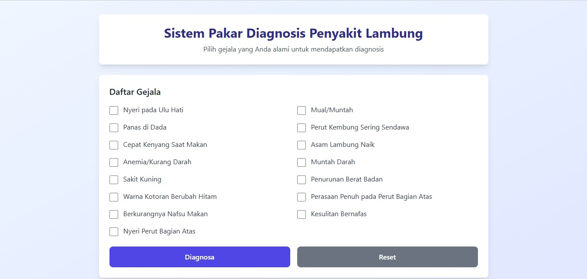

# 🏥 Sistem Pakar Diagnosis Penyakit Lambung

Sistem pakar berbasis web untuk mendiagnosis penyakit lambung menggunakan metode Forward Chaining. Aplikasi ini membantu mengidentifikasi kemungkinan penyakit lambung berdasarkan gejala-gejala yang dialami pengguna.


## 📋 Daftar Isi

- [Fitur](#-fitur)
- [Demo](#-demo)
- [Teknologi](#-teknologi)
- [Instalasi](#-instalasi)
- [Cara Penggunaan](#-cara-penggunaan)
- [Knowledge Base](#-knowledge-base)
- [Metode Diagnosis](#-metode-diagnosis)
- [Struktur Proyek](#-struktur-proyek)
- [Kontribusi](#-kontribusi)
- [Lisensi](#-lisensi)
- [Kontak](#-kontak)

## ✨ Fitur

- ✅ **Interface Modern & Responsif** - Desain yang menarik dan mobile-friendly menggunakan Tailwind CSS
- 🔍 **Diagnosis Cerdas** - Sistem Forward Chaining untuk mencocokkan gejala dengan penyakit
- 📊 **Visualisasi Hasil** - Menampilkan persentase kesesuaian dengan progress bar
- 💡 **Solusi & Saran** - Memberikan rekomendasi penanganan untuk setiap diagnosis
- 🎯 **Multi-Diagnosis** - Menampilkan semua kemungkinan penyakit yang cocok, diurutkan berdasarkan prioritas
- ⚡ **Real-time Processing** - Tidak memerlukan server backend, proses diagnosis instant
- 🔄 **Reset Function** - Mudah untuk mengulang diagnosis

## 🎬 Demo

[Live Demo](https://wildanmukmin.github.io/uas-sispak/)

### Screenshot



## 🛠 Teknologi

Proyek ini dibangun menggunakan:

- **HTML5** - Struktur halaman web
- **CSS3** - Styling dasar
- **JavaScript (Vanilla)** - Logika sistem pakar
- **Tailwind CSS** - Framework CSS untuk styling modern
- **PHP Native** - _(Optional, bisa dikembangkan untuk backend)_

## 📥 Instalasi

### Prasyarat

- Web browser modern (Chrome, Firefox, Safari, Edge)
- Text editor (VS Code, Sublime Text, dll.) - _untuk development_
- Local server (XAMPP, WAMP, LAMP) - _opsional_

### Langkah Instalasi

1. **Clone repository**

   ```bash
   git clone https://github.com/username/sistem-pakar-lambung.git
   ```

2. **Masuk ke direktori proyek**

   ```bash
   cd sistem-pakar-lambung
   ```

3. **Buka file di browser**
   - Bisa langsung membuka file `index.html` di browser
   - Atau jalankan menggunakan local server:
     ```bash
     # Jika menggunakan PHP built-in server
     php -S localhost:8000
     ```
     Kemudian buka `http://localhost:8000` di browser

## 📖 Cara Penggunaan

1. **Pilih Gejala**

   - Buka aplikasi di browser
   - Centang semua gejala yang Anda alami dari daftar yang tersedia

2. **Lakukan Diagnosis**

   - Klik tombol "Diagnosa" untuk memproses
   - Sistem akan menganalisis gejala yang dipilih

3. **Lihat Hasil**

   - Hasil diagnosis akan muncul di bawah form
   - Diagnosis dengan persentase tertinggi adalah yang paling cocok
   - Baca solusi dan saran yang diberikan

4. **Reset** (Opsional)
   - Klik tombol "Reset" untuk mengulang diagnosis

## 📚 Knowledge Base

### Daftar Penyakit

| Kode | Nama Penyakit   | Jumlah Gejala |
| ---- | --------------- | ------------- |
| P01  | GERD            | 3             |
| P02  | Gastric Cancer  | 5             |
| P03  | Advanced Cancer | 5             |
| P04  | Acute Ulcer     | 6             |
| P05  | Chronic Ulcer   | 7             |

### Daftar Gejala (15 Gejala)

- Ga: Nyeri pada Ulu Hati
- Gb: Mual/Muntah
- Gc: Panas di Dada
- Gd: Perut Kembung Sering Sendawa
- Ge: Cepat Kenyang Saat Makan
- Gf: Asam Lambung Naik
- Gg: Anemia/Kurang Darah
- Gh: Muntah Darah
- Gi: Sakit Kuning
- Gj: Penurunan Berat Badan
- Gk: Warna Kotoran Berubah Hitam
- Gl: Perasaan Penuh pada Perut Bagian Atas
- Gm: Berkurangnya Nafsu Makan
- Gn: Kesulitan Bernafas
- Go: Nyeri Perut Bagian Atas

## 🔬 Metode Diagnosis

Sistem ini menggunakan **metode Forward Chaining** dengan langkah-langkah berikut:

1. **Input Gejala** - Pengguna memilih gejala yang dialami
2. **Pattern Matching** - Sistem mencocokkan gejala dengan knowledge base
3. **Perhitungan Persentase** - Menghitung tingkat kesesuaian:
   ```
   Persentase = (Jumlah Gejala Cocok / Total Gejala Penyakit) × 100%
   ```
4. **Ranking** - Mengurutkan hasil berdasarkan persentase tertinggi
5. **Output** - Menampilkan diagnosis lengkap dengan solusi

## 📁 Struktur Proyek

```
sistem-pakar-lambung/
│
├── index.html          # File utama aplikasi
├── README.md           # Dokumentasi proyek
├── screenshot.png      # Screenshot aplikasi (opsional)
└── LICENSE            # File lisensi (opsional)
```

### Untuk Pengembangan Lebih Lanjut:

```
sistem-pakar-lambung/
│
├── index.php           # Halaman utama
├── config/
│   └── database.php    # Konfigurasi database
├── includes/
│   ├── header.php      # Header template
│   └── footer.php      # Footer template
├── assets/
│   ├── css/
│   │   └── style.css   # Custom CSS
│   ├── js/
│   │   └── script.js   # Custom JavaScript
│   └── img/            # Folder gambar
├── admin/              # Panel admin untuk manage data
│   ├── index.php
│   ├── penyakit.php
│   └── gejala.php
└── README.md
```

## 🤝 Kontribusi

Kontribusi sangat diterima! Jika Anda ingin berkontribusi:

1. Fork repository ini
2. Buat branch fitur baru (`git checkout -b fitur-baru`)
3. Commit perubahan Anda (`git commit -m 'Menambahkan fitur baru'`)
4. Push ke branch (`git push origin fitur-baru`)
5. Buat Pull Request

### To-Do List

- [ ] Tambahkan database MySQL untuk menyimpan riwayat diagnosis
- [ ] Implementasi panel admin untuk manage knowledge base
- [ ] Tambahkan fitur export hasil diagnosis ke PDF
- [ ] Tambahkan grafik visualisasi data
- [ ] Implementasi user authentication
- [ ] Tambahkan fitur konsultasi online dengan dokter
- [ ] Multi-language support (EN, ID)

## 📄 Lisensi

Proyek ini dilisensikan di bawah [MIT License](LICENSE) - lihat file LICENSE untuk detail lebih lanjut.

## 📞 Kontak

**Wildan Mukmin**

- Email: wildanmukmin26@gmail.com
- GitHub: [@WildanMukmin](https://github.com/WildanMukmin)
- LinkedIn: WildanMukmin(https://linkedin.com/in/WildanMukmin)

## ⚠️ Disclaimer

Sistem ini dibuat untuk tujuan edukasi dan sebagai alat bantu awal dalam mengidentifikasi kemungkinan penyakit lambung. **Hasil diagnosis tidak menggantikan konsultasi dengan dokter profesional**. Untuk diagnosis yang akurat dan penanganan yang tepat, silakan konsultasikan dengan tenaga medis profesional.

---

⭐ Jika proyek ini bermanfaat, jangan lupa berikan **Star** pada repository ini!
